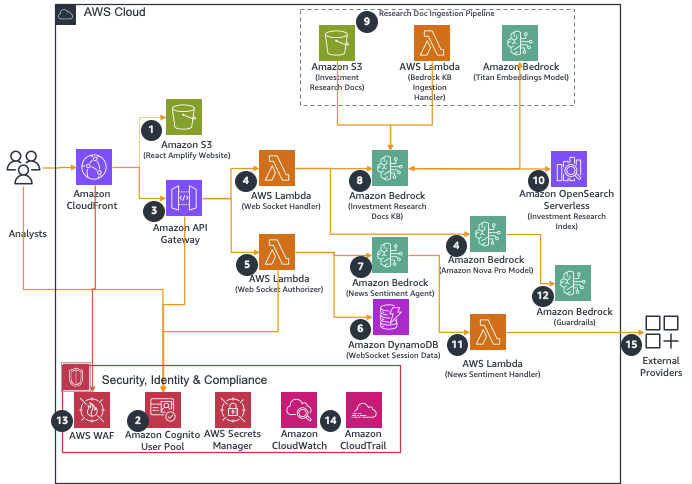
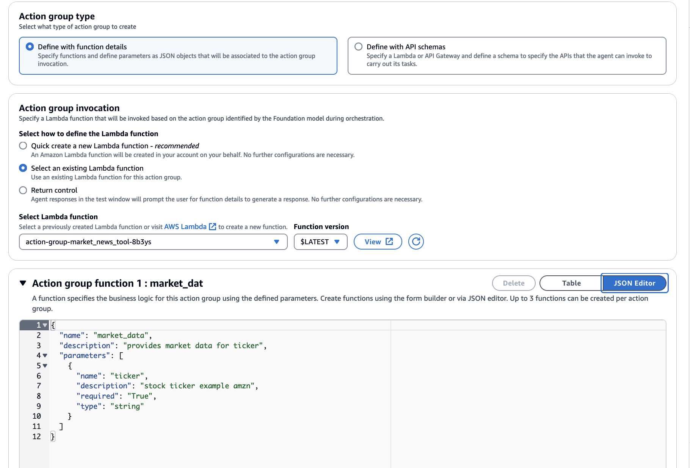
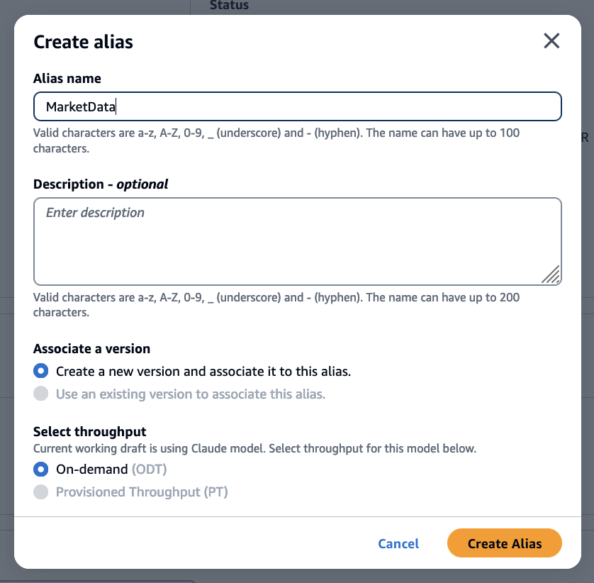
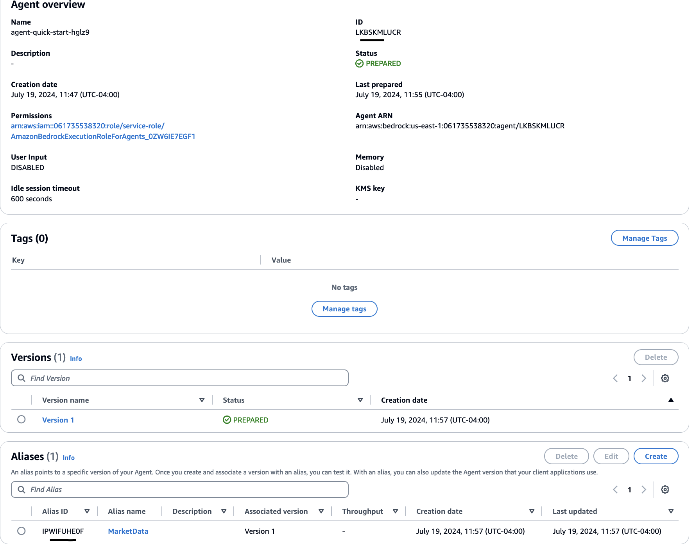
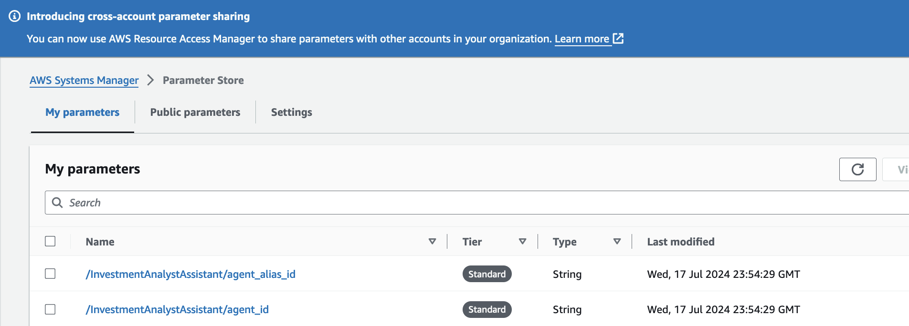
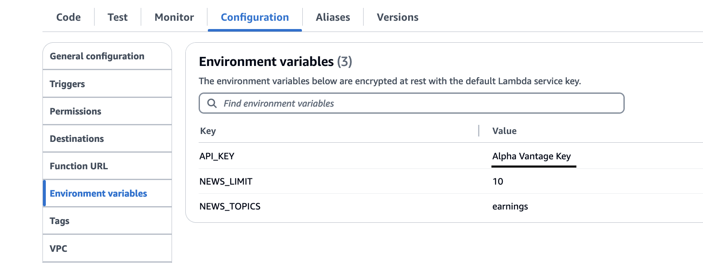
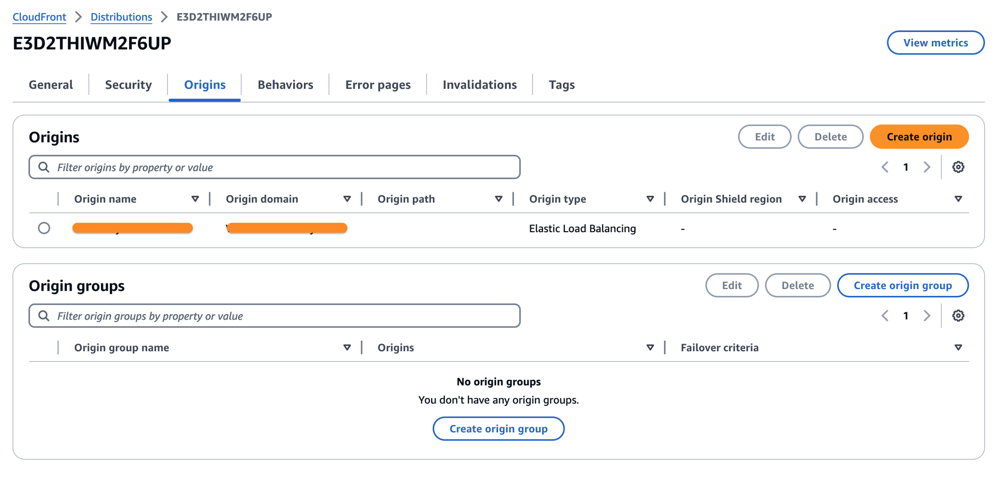
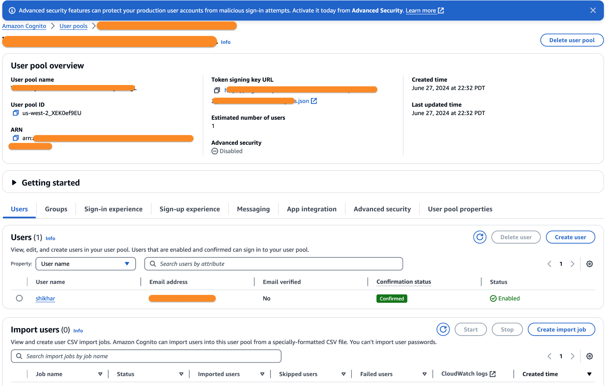
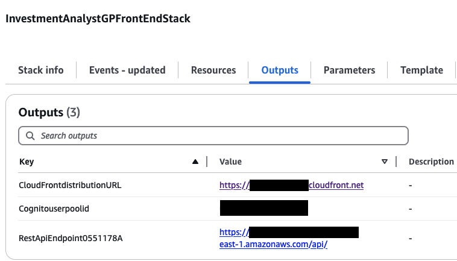
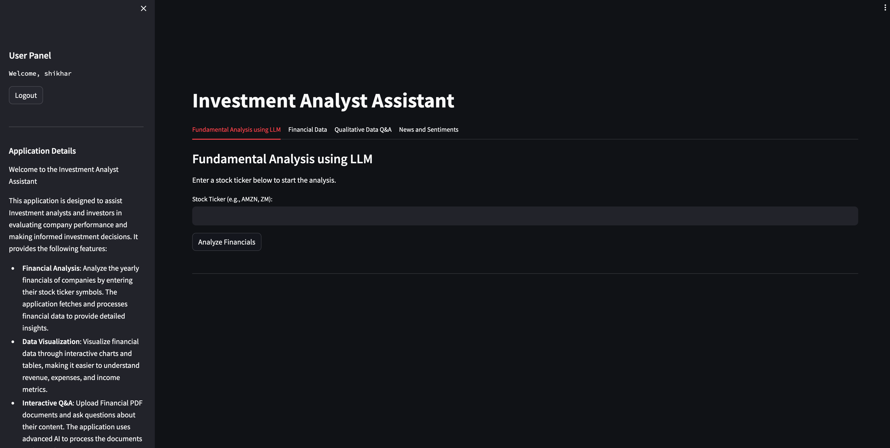

# Guidance for Investment Analyst Assistant on AWS

This repository contains guidance for implementing Generative AI based Investment Analyst Assistant application using Amazon Bedrock and other AWS Services. The guidance will process and analyze financial statements, market data, and news data to produce comprehensive investment reports, helping analysts make informed decisions quicker.

## Table of Contents

1. [Overview](#overview)
    - [Cost](#cost)
2. [Prerequisites](#prerequisites)
    - [Operating System](#operating-system)
3. [Deployment Steps](#deployment-steps)
4. [Deployment Validation](#deployment-validation)
5. [Running the Guidance](#running-the-guidance)
6. [Next Steps](#next-steps)
7. [Cleanup](#cleanup)
8. [FAQ, known issues, additional considerations, and limitations](#faq-known-issues-additional-considerations-and-limitations)
9. [Revisions](#revisions)
10. [Notices](#notices)
11. [Authors](#authors)

## Overview

Almost all firms in the capital markets space perform some type of investment analyses – from sector analysis to individual stocks.

Some of these firms perform research on investment, and many actively manage investments for institutional or individual clients. Financial organizations generate, collect, and use data to gain insights into financial operations, make better decisions, and improve performance. However, there are challenges associated with multi-modal data due to the complexity and lack of standardization in financial systems and data formats and quality, as well as the fragmented and unstructured nature of the data.

By following this architecture, you can build a Generative AI based Investment Analyst Assistant application using Amazon Bedrock and other AWS Services. The guidance package will process and analyze financial statements, market data, and news data to produce comprehensive investment reports, helping analysts make informed decisions quicker.

Core Features:

- Summarize Stock Fundamentals data using Large Language Model(LLM).
- Query unstructured documents (10K, 10Q pdf) using Retrieval Augumented Generation and LLM.
- Analyze Stock News and Summarize Sentiments using LLM.

## Architecture Diagram



## High-Level Overview and Flow

1. The app is hosted on `Amazon ECS Fargate` and served via `Amazon CloudFront`.

2. The user authenticates to the application via `Amazon Cognito` user pools. The application retrieves an API key, URL, and Amazon Cognito user pool ID from AWS Secrets Manager.

3. User provides stock ticker or stock name for performing fundamental income statement analysis. Application executes `LangChain Agent` which leverages available tools to retrieve ticker related income statement data from yahoo finance.

4. Retrieved financial data and specific prompt are sent to `Amazon Bedrock Anthropic Claude` model to perform quantitative data analysis and obtain Financials summary. User can view summary data in chart, tabular and summary format in the application.

5. For further analysis using qualitative data, users can upload financials documents such as 10K/10Q pdf documents and perform further analysis. `Amazon Bedrock Titan Embeddings Model` is used to convert text data into vectors.

6. Vector data is stored in `Amazon Aurora RDS Postgres` Vector data store.

7. For user queries, retriever chain is executed to perform similarity search on data stored in Vector store and results sent along with prompt to Bedrock  Anthropic Claude model. Bedrock LLM provides answers for queries along with citations.

8. User provides stock ticker for analyzing stock sentiment based on stock related news.

9. `Bedrock Agent` invokes `AWS Lambda` to obtain live news data (via Alpha vantage API). Stock ticker sentiment is summarized using Bedrock LLM.

10. User creates an ingestion pipeline where research data is uploaded to `Amazon S3` and indexed in `Amazon Aurora PostgreSQL` vector DB via `Knowledge Bases for Amazon Bedrock`.

11. User queries for portfolio analysis that retrieves Investment analysis reports generated via LangChain agent coupled with `Aurora PostgreSQL`.

### Cost

Pricing for Bedrock involves charges for model inference and customization. Note that some token pricing for 3P models on Amazon Bedrock is not included in the cost calculator

Check out the [cost calculator](https://calculator.aws/#/estimate?id=6cfc315f3b5ada689f59ecb76e1b3c5f32db0c83) for deploying this project.

*Note: For the most current and detailed pricing information for Amazon Bedrock, please refer to the [Amazon Bedrock Pricing Page](https://aws.amazon.com/bedrock/pricing/).*

_We recommend creating a [Budget](https://docs.aws.amazon.com/cost-management/latest/userguide/budgets-managing-costs.html) through [AWS Cost Explorer](https://aws.amazon.com/aws-cost-management/aws-cost-explorer/) to help manage costs. Prices are subject to change. For full details, refer to the pricing webpage for each AWS service used in this Guidance._

### Sample Cost Table

**Note : Once you have created a sample cost table using AWS Pricing Calculator, copy the cost breakdown to below table and upload a PDF of the cost estimation on BuilderSpace. Do not add the link to the pricing calculator in the ReadMe.**

The following table provides a sample cost breakdown for deploying this Guidance with the default parameters in the US East (N. Virginia) Region for one month.

<!-- | AWS service  | Dimensions | Cost [USD] |
| ----------- | ------------ | ------------ |
| Amazon API Gateway | 1,000,000 REST API calls per month  | $ 3.50month |
| Amazon Cognito | 1,000 active users per month without advanced security feature | $ 0.00 | -->

| Description | Service | Upfront [USD] | Monthly [USD] | First 12 months total [USD] | Configuration summary |
|-------------|----------|--------------|--------------|----------------------------|-------------------------|
| TextGeneration Lambda | AWS Lambda | 0 | 0 | 0 | Architecture (x86), Number of requests (10 per hour), Amount of ephemeral storage allocated (512 MB) |
| | AWS Secrets Manager | 0 | 1.3 | 15.6 | Number of secrets (2), Average duration of each secret (30 days), Number of API calls (100000 per month) |
| ImageGeneration Lambda | AWS Lambda | 0 | 0 | 0 | Architecture (x86), Number of requests (100000 per month), Amount of ephemeral storage allocated (512 MB) |
| | S3 Standard | 0 | 23.88 | 286.56 | S3 Standard storage (1 TB per month) |
| | Application Load Balancer | 0 | 77.75 | 933 | Number of Application Load Balancers (1) |
| | AWS Fargate | 0 | 34.15 | 409.8 | Operating system (Linux), CPU Architecture (ARM), Average duration (20 minutes), Number of tasks or pods (20 per day), Amount of memory allocated (10 GB), Amount of ephemeral storage allocated for Amazon ECS (20 GB) |
| | Amazon API Gateway | 0 | 62.74 | 752.88 | Average size of each request (3400 KB), REST API request units (millions), Average message size (32 KB), Requests (10 per month) |
| | Amazon OpenSearch Service | 0 | 703.2 | 8438.4 | How many Indexing OCUs? (2), How many Search and Query OCUs? (2), How big is the index data? (100 GB) |
| | Titan Text Embeddings | 0 | 100 | 1200 | Number of Input tokens (1000 million per month) |
| | Titan Multimodal Embeddings | 0 | 220 | 2640 | Number of Input Images (1 million per month), Number of input tokens (200 million per month) |
| | AWS Lambda | 0 | 0 | 0 | Architecture (x86), Amount of ephemeral storage allocated (512 MB), Number of requests (100000 per month) |
| | AWS Lambda | 0 | 0 | 0 | Architecture (x86), Amount of ephemeral storage allocated (512 MB), Number of requests (100000 per month) |
| | Amazon Cognito | 0 | 5 | 60 | Advanced security features (Enabled), Number of monthly active users (MAU) (100) |
| | DynamoDB provisioned capacity | 780 | 146.55 | 2538.6 | Average item size (all attributes) (5 KB), Data storage size (100 GB) |
| | AWS Lambda | 0 | 14.17 | 170.04 | Architecture (x86), Amount of ephemeral storage allocated (512 MB), Number of requests (1000000 per month) |
| | Bedrock Claude Sonnet | 0 | 8100 | 97200 | Text Generation model available on Amazon Bedrock |
| | Stable Diffusion SDXL 1 | 0 | 4000 | 48000 | Image generation model available on Amazon Bedrock|

## Prerequisites

### Operating System

These deployment instructions are optimized to best work on a pre-configured `Amazon Linux 2023 AWS Cloud9 (t3.2xlarge (32 GiB RAM + 8 vCPU))` development environment. Refer to the [Individual user setup for AWS Cloud9](https://docs.aws.amazon.com/cloud9/latest/user-guide/setup-express.html) for more information on how to set up Cloud9 as a user in the AWS account. Deployment using another OS may require additional steps, and configured python libraries (see [Third-party tools](#third-party-tools)).

### Third-party tools

Before deploying the guidance code, ensure that the following required tools have been installed:

- AWS Cloud Development Kit (CDK) >= 2.126.0
- Python >= 3.8
- Streamlit

### AWS account requirements

**Required resources:**

- [Bedrock Model access](https://docs.aws.amazon.com/bedrock/latest/userguide/model-access.html) for Claude 3.5 Sonnet, and Amazon Titan embeddings Model
- S3 bucket
- VPC
- IAM role with specific permissions
- AWS CLI
- [AWS CDK](https://docs.aws.amazon.com/cdk/v2/guide/getting_started.html)

### Requesting Access to AWS Bedrock

1. Log in to the AWS Management Console
2. Search for "Bedrock" in the search bar
3. Click "Get Started" on the Amazon Bedrock service page
4. Click "Manage Model Access" in the popup
5. Select "Amazon" from the list of available models
6. Click "Request Model Access" at the bottom of the page
7. Make sure to enable Model access for `Amazon Titan Embeddings G1 - Text`, `Anthropic Claude 3 Sonnet`  & `Anthropic Claude 3.5 Sonnet` model.

### Supported Regions

The the services used in the Guidance do not support all Regions, hence the guidance package is well suited to be deployed in `us-west-2` and `us-east-1` region.

### aws cdk bootstrap

This Guidance uses AWS CDK. If you are using aws-cdk for the first time, please see the [Bootstrapping](https://docs.aws.amazon.com/cdk/v2/guide/bootstrapping.html) section of the AWS Cloud Development Kit (AWS CDK) v2 developer guide, to provision the required resources, before you can deploy AWS CDK apps into an AWS environment.

## Deployment Steps

1. In the Cloud9 IDE (`t3.2xlarge instance` with `Amazon Linux 2023`), use the terminal to clone the repository:
   ```
   git clone https://github.com/aws-solutions-library-samples/guidance-for-investment-analyst-assistant-on-aws.git
   ```
2. Edit `docker_app/config_file.py`, choose a unique `STACK_NAME` and a `CUSTOM_HEADER_VALUE`.

3. Navigate to the folder: docker_app using
   ```
   cd docker_app
   ```

4. This project is a Python Project. Switch to the Virtual Env using the below command:
   ```
   python3 -m venv .venv
   ```

5. After the init process completes and the virtualenv is created, you can use the following step to activate your virtualenv. Execute the following to activate the environment:
   ```
   source .venv/bin/activate
   ```

6. Install the required dependencies in the virtual environment. Please make sure you have installed aws cdk following the pre-requisites :
   ```
   python3 -m pip install -r requirements.txt
   ```

7. Initialize CDK within the project using the command:
   ```
   cdk init
   ```

8. Bootstrap the CDK environment using the command :
   ```
   cdk bootstrap
   ```

9. Verify that the CDK deployment correctly synthesizes the CloudFormation template:
   ```
   cdk synth
   ```

10. Deploy the Backend Components running the following command:
   ```
   cdk deploy 
   ```

Once you run the above command in cloud 9 environment, it will take approximately *10 minutes* to deploy the entire stack. Note that as part of this stack creation, make a note of the outputs, in which you will find the `CloudFront distribution URL`, `Cognito user pool id`, and parameters for Bedrock Agents.

## Deployment Validation

- To verify a successful deployment of this guidance, open [CloudFormation](https://console.aws.amazon.com/cloudformation/home) console, and verify that the status of the stack named `InvestmentAnalystStack` is `CREATE_COMPLETE`.
- Once the project is deployed, AWS assets are created in your application. You can navigate to AWS CloudFormation console and click on aforementioned stack. Now you can click on `resources` tab which shows all the resources created by the stack.

## Running the Guidance

- Once cdk stack is deployed and assets are created, you can navigate setup the Amazon Knowledge Base and Amazon Bedrock Agents to leverage custom agent tool.

- **Amazon Bedrock Knowledge base creation**
   #### Create S3 Bucket
   In the S3 bucket, we will store various information related to stock research reports and basic information related to Investments. 

   - Search on Amazon S3 in the search console and create S3 bucket. The name of the bucket should start with your AWS account number and some random number. The following should be the format **AWSAccountNo-investment-RandomNo**
   - Download investment research Articles and upload them in the S3 bucket.  


   #### Create Amazon Bedrock KnowledgeBase

   - Go to Amazon Bedrock Console --> Builder Tool --> Knowledge Bases

   - Click on Create Knowledge Bases.

   - Provide Knowledge Bases Name as 'Investment-KB'. Keep everything as default and click on next. The default selections are S3 Bucket for datasource and create new IAM Role

   - Provide Datasource Name as: Investment-research-reports and select the name of S3 bucket created in the previous step for S3 URI

   - Keep everything as default and click on next

   - Select "Titan Text Embeddings v2" as embedding model

   - Select "Quick create a new vector store - Recommended" for vector database

   - Click on next and then click on Create Knowledge Base

   This will create new knowledge base. We can add more data sources if needed. 

   ### Modify System Parameters

   - Navigate to the AWS Systems Manager console 
   - Go to the toggle on the left, and under Application Management select Parameter Store
   - Select and edit following parameters - **'/InvestmentAnalystAssistant/kb_id'**
   - Set value of knowledge base from the previous steps

- **Amazon Bedrock Agent Creation**
  - Navigate to Amazon Bedrock Agents in AWS console. Click on `Create Agent` to initiate building a new Bedrock Agent.
  - Follow the instructions [here](https://docs.aws.amazon.com/bedrock/latest/userguide/agents-create.html) to create a new agent.
  - Provide a unique name to the Bedrock agent. Agent description is optional, so that can be skipped.
  - Under `Agent resource role` select `Create and use a new service role`.
  - Under `select model` section, select `Anthropic Claude 3.5 Sonnet` model.
  - Next, where it mentions `Instructions for the Agent`, add the below set of instructions to the agent:

   ```
   "Provide the latest news and sentiment analysis for {ticker}. For each news item, include the following fields:
    - title: The title of the news article
    - summary: A brief summary of the news article
    - source: The source of the news article
    - url: The URL of the news article
    - ticker_sentiment_score: The sentiment score of the news article related to the ticker
    - ticker_sentiment_label: The sentiment label of the news article related to the ticker

    Example output:
    {{
        "news": [
            {{
                "title": "Title of the article",
                "summary": "Brief summary of the article",
                "source": "Source of the article",
                "url": "URL of the article",
                "ticker_sentiment_score": "Sentiment score",
                "ticker_sentiment_label": "Sentiment label"
            }},
            ...
        ],
        "summary": "Overall summary of the news articles related to the ticker"
    }}”.
   ```

  - Save the above information. Next, we will add an action group. 
  - After scrolling further, under the `Action groups` section, you can choose `Add` to add action groups to your agent.
  - Under `Action group type`, select `Define with Function Details`. Name the action group as `action-group-market_news_tool`.
  - For the Action group Schema, we will choose `Define via in-line schema editor`. Replace the default schema in the In-line OpenAPI schema editor with the schema provided below:
  
  ```
   {
    "name": "market_data",
    "description": "provides market data for ticker",
    "parameters": [
      {
        "name": "ticker",
        "description": "stock ticker example amzn",
        "required": "True",
        "type": "string"
      }
    ]
  }
   ```


  
  - Click on `Prepare`. Once it is successfully prepared, please Click on `Save and exit`.
  - Enable the Action status for the action group to influence the Agent's response, and click on `Create`. You will land back on Agent Builder page. Click on `Save` button mentioned on the top next to Agent builder.
  <!-- - Next, in the `Knowledge bases` section, select the knowledge base that you just created in the previous step. You can keep rest of the instructions as default. Note that in the instructions for knowledge base, copy paste the following text and click `Add`:
  ```
   Knowlegde base contains information comprising of multiple csv files about product catalog, customer reviews for the products that can be recommended as well as future trends in clothing and style.
  ``` -->

  - Once added, and you land back on Agent builder page, click on `Save` on top right and next, you can click on `Prepare` to prepare the agent to test the latest changes, on the right pane under `Test Agent`. Now, click `Save and Exit` next to Agent builder. Please note that when creating the agent, after inputting the instructions, make sure you save the configuration and double check the model and instructions privided to the agent as this might be reset within Bedrock console.
  - Once the agent configuration and building portion is completed, it's time to create an alias and version of your agent.
  - Click on `Create Alias` under Agent Overview page. In the `Aliases` section, enter a unique Alias name and provide an optional Description. In order to create a new version, choose `Create a new version and to associate it to this alias`. You can provide Alias Name as `MarketData` and choose `Create a new Version` and throughput as `OnDemand`.
  - Under Select throughput, select the option to let your agent run model inference at the rates set for your account, select `On-demand (ODT)`.
  - Then,Select `Create Alias`.



  - Once created, note the `AgentID` and `Agent Alias` as shown below.



- **Modify Bedrock Agents Parameters**
  - Navigate to the `AWS Systems Manager` console. Go to the toggle on the left, and under `Application Management` select `Parameter Store`.
  - Select and edit following parameters - `/InvestmentAnalystAssistant/agent_id` and `/InvestmentAnalystAssistant/agent_alias_id`. Set values from previous steps.

  - After updating this, please delete the ECS task that was currently running. It will re-run and move from `pending` to `completed`. This will fetch the updated paramter values for Agent ID and Agent Alias ID in the streamlit application. 

- **Create Alpha Vantage Key & Setup the Environment Variable for Lambda Function**
  - Please create an alphavantage key by accessing `https://www.alphavantage.co/support/#api-key` url. We will use this as key value in the next steps.
  - Navigate to AWS console and search for lambda in the search bar. Find the lambda function with name starting as `-Market*`.
  - Click on `Configuration` and then, navigate to `Environment variables`.
    - Click on the "Edit" button to modify the environment variables.
    - For the "Key" field, you should see some values corresponding to API_KEY and other environment variables.
    - For the "Value" field, enter the actual value you obtained from Alpha Vantage. Click `Save` to apply the changes as shown below.


<!-- - **Weather API Agent**
  - The cdk stack additionally deploys weather api agent lambda function. This weather agent lambda function integrates with Amazon Bedrock Agent you created in the earlier steps in order to fetch the accurate weather conditions based on the user's input location within the query.
  - Note that the lambda function created for weather agent needs to have openweather map API key to fetch the accurate weather conditions pertaining to a given location. Follow the below instructions in order to create your weather api key:
    - Navigate to [openweathermap](https://home.openweathermap.org/) and register an account on the website.
    - Once you have created the account, navigate to [API keys web-page](https://home.openweathermap.org/api_keys) and click on generate your weather api key. An api key with the name you type will be created as shown below.

  - Once that has been created, you can use the api key in your Action group lambda function for weather api agent as part of environment variable as shown in the following section. -->
<!-- 
- **Action Group Lambda Function for Weather API Agent**
  - The Virtual Personal Stylist application uses a Lambda function that is associated with an `Action Group` in the Bedrock Agent. This Lambda function is triggered when the Bedrock Agent is invoked from the text generation lambda function called via front-end of the application.
  - You have already associated this lambda function (`VirtualStylistStack-WeatherFunction..`) to your Amazon Bedrock Agent.
  - Simply navigate to the environment variable of the lambda function as shown earlier and provide `YOUR_OPENWEATHERMAP_API_KEY` you fetched in the previous section. This API key is required to authenticate and make requests to the OpenWeatherMap API.
  - Additionally, we are using requests library in this lambda function to trigger OpenWeatherMap API. By default, requests library does not exist in the existing dependency packages. Follow the next section to create your own lambda layer and attach it to this lambda function. -->

- **Instructions for creating lambda layer**
  - A Lambda Layer is a mechanism in AWS Lambda that allows you to package and share common code, libraries, or other dependencies that can be used by multiple Lambda functions. This helps to optimize the size of your Lambda functions, as the layer can be shared across functions, reducing the overall deployment package size. Check out more details on lambda layers [here](https://docs.aws.amazon.com/lambda/latest/dg/chapter-layers.html).
  - In the case of the agent Lambda function, the `layers.zip` file should contains the "requests" library, which is required for making HTTP requests to the `alphavantage API`.
  - A build script has been provided in github to directly run in your local directory following the below instructions:
    - Save the script to a file, for example:
    ```
    create_lambda_layer.sh
    ```

    - Make the script executable by running:
    ```
    chmod +x create_lambda_layer.sh
    ```

    - Run the script:
    ```
    ./create_lambda_layer.sh
    ```
  
  [OPTIONAL] In case you created the lambda layer already, these steps are not required. 
  - Alternatively, given below are the instructions to create Lambda Layer for calling requests library in the agent lambda function. In order to create the lambda layer, follow the following instructions in your local system:
    - Create a folder through your local terminal (iterm/terminal) using the following command :
    ```
    mkdir layer
    ```
    - Navigate into the folder:
    ```
    cd layer
    ```
    - Create a new directory:
    ```
    mkdir python
    ```
    - Run this command within the python folder :
    ```
    pip install -t python requests
    ```
    - Now, zip the contents of of file within the folder and name is layers.zip using :
    ```
    zip -r12 layers.zip python
    ```
  - Now that you have created the layers.zip file with r12 (aka runtime python 3.12 version), you should be able to upload this zip file and attach as a layer to your lambda function for leveraging in the stylist application.
  
  - **Custom Layer upload steps**:
    - Open the [Layers page](https://console.aws.amazon.com/lambda/home#/layers) of the Lambda console.
    - Choose Create layer.
    - Under Layer configuration, for Name, enter a unique name for your layer.
    - (Optional) For Description, enter a description for your layer.
    - Layer upload: To upload a .zip file from your computer that you just created, choose Upload a .zip file. Then, choose `Upload` to select your local `.zip` file.
    - Select the `Compatible runtimes` as `python3.12, python3.11, python3.10, python3.9`, keeping other options unchanged.
    - Click on `Create` to create this layer.

- **Attaching a layer to lambda function**
  - In order to add a layer to a function (console), following the below steps:
    - Open the Functions page of the Lambda console.
    - Choose the  function to configure by searching for Market within the lambda console. Find the lambda function with name starting as `-Market*` pop up in your list of lambda functions. Select this lambda function and scroll down to `Layers` section.
    - Under `Layers`, choose `Add a layer` button.
    - Under `Choose a layer`, choose a layer source:
      - For the AWS layers or Custom layers layer sources, choose a layer from the pull-down menu.
      - Under `Version`, choose a layer version from the pull-down menu.
      - For the `Specify an ARN` layer source, enter an `ARN` in the text box and choose Verify. Then, choose `Add`.
    - Once the layer is attached, you can save the lambda function configuration.

The use of a Lambda function, environment variables, and custom libraries (as Lambda Layers) demonstrates the flexibility and extensibility of the Virtual Personal Stylist application, allowing for the integration of various third-party services and functionalities as needed. In case you want to create your own lambda layer, follow the next section.

Apart from the above functions, additional lambda functions are created as part of CDK stack deployment but no setup or configuration changes is required for running the application. The user can now proceed with the front-end deployment instructions.

- **Front-End Configuration**
  - By default, the Streamlit frontend application verifies that a user is authenticated with the Amazon Cognito user pool. Amazon API Gateway checks for the API key in every HTTP request to prevent the unauthorized access to the API. However, if you would like to add access control capabilities, you can use Amazon Verified Permissions that allows you to define your permissions model (e.g., RBAC based on Cognito groups membership) with the help of Cedar policies. Please refer to the "Set up with API Gateway and an identity source" in the [service documentation](https://docs.aws.amazon.com/verifiedpermissions/latest/userguide/policy-stores_create.html). You can use this short video for using Amazon Verified Permissions to create this functionality in the app - [Lambda Authorizer setup](https://youtu.be/R7QuHGbKt5U)

  - Now that the application has been deployed, you can login via the browser using Cloudfront URL or load balancer DNS URL. In case you face any issues: n
    - Navigate to `CloudFront` from AWS console using search bar, click on `Distributions` and select the `CloudFront Distributions` created for you via CDK stack deployment.
    - Once you are within the `CloudFront Distrubution`, click on `Origins`. Under `Origins`, select the origin as shown below and click on `Edit`.
   
    - Under `Settings`, select protocol as `HTTP only` with port `80` as the origin's HTTP port (as shown below). Click on `Save Changes`.
   
    - Now your cloudfront has been properly configured.

- After opening the app in your browser, you will be presented with login page. In order to login, you need to create a user in Amazon Cognito. With a user pool, your users can sign in to your web or mobile app through Amazon Cognito.

- **Create a new user in Amazon Cognito**
  - Go to the [Amazon Cognito console](https://console.aws.amazon.com/cognito/home) . If prompted, enter your AWS credentials.
  - Navigate to user pools on the left side of the panel. You should see a user pool created via CDK stack.
  - Click on the pre-created user pool. You will land on the image shown below:
   
  - As shown in the image, you can click on `Users` tab below `Getting Started` section and click on `create user` to create your user profile.
  - Now, create a new user by providing username, valid email address and temporary password to login to the application.
  - After this setup, you should be able to login and launch your application!

- Once this setup is completed, you can select the `InvestmentAnalystStack.CloudFrontURL` value from your `Cloud9` output when you deployed the stack. After deployment, the output of the deployment in the terminal contains the link for running your application in your browser. Paste the link in your browser to launch the application. Feel free to play with the application. Cheers!

## Guidance Demo

- Now that all the configuration steps are completed, you should be able to open the Cloudfront URL as detailed above and start playing with the app.


- Enter User ID and Password (setup in Amazon Cognito step) in order to login to the application.

- Please read the application details from the left panel and execute different user scenarios.

<!-- 
- **Text Generation Feature**
  - Once you login to the app using your username and password that you created in Cognito above, you will land on the Chat portal similar to what is shown below. Note that the UI frontend may look a bit different, though the key features/functionality will be the same.
   
  - You can enter the following query in the chat box and click on `Send`:
  ```
  I'm a 30 year old female traveling to Delhi for a friends wedding. What to wear for the function?
  ```
   
  
  - This shows the textual recommendation received for the user based on their profile and weather conditions for the location fetched from Amaon Bedrock Agents interacting with OpenWeatherAPI tool.

- **Image Generation Feature**
  - Now we can copy the text recommendation as shown below and go to Generate Image tab to generate an image recommendation. This invokes Stable Diffusion SDXL1.0 model available on Amazon Bedrock to generate a suitable image from the input text, as shown below in the image.
  - After clicking on `Generate Image`, you should be able to see an image recommendation generated pertaining to the input text.
   

- **Product Image Search Feature**
  - Now let's navigate to the Product search tab (3rd tab) within the app UI, and try out the search feature. This feature is able to search and display for top 3 images from the stored data (S3) that resembles the search query entered by the user.
  - As shown in the image below, the user copies the previously generated textual recommendation from the LLM availble on Amazon Bedrock and pastes in the the text box to get image recommendations from the image catalog.
  

  - Note that the images pre-existing in the database are being displayed in the output based on the similarity score. If the images corresponding to the text are not present in the your stored data, the image recommendations might not be very useful to the end user.
   

Now you may go back to the chat feature and experiment with our other activities as shown below. Notice that the Agent may ask a follow up question for the user question and provides a clothing recommendation based on information extracted from the query and using RAG approach by extracting custom styling recommendations from the stored data:  
   ```
   I'm planning to go to Alaska for a few days. What to wear?
   ```


- Check solution demo for more details - [Solution Demo](https://youtu.be/EqJ7TmTbbD8) -->

## Next Steps

Here are some suggestions and recommendations on how customers can modify the parameters and components of the Virtual Personal Stylist application to further enhance it according to their requirements:

1. **Customization of the User Interface (UI)**:
   - Customers can customize the frontend to match their branding and design requirements.
   - They can modify the layout, color scheme, and overall aesthetic of the application to provide a seamless and visually appealing experience for their users.
   - Customers can also integrate the application with their existing web or mobile platforms to provide a more cohesive user experience.

2. **Expansion of the Knowledge Base**:
   - Customers can expand the knowledge base by ingesting additional data sources, such as industry trends, seasonal fashion information, and user preferences.
   - This can help improve the quality and relevance of the styling recommendations provided by the application.
   - Customers can also explore incorporating user feedback and interactions to continuously refine and update the knowledge base.

3. **Integration with External Data Sources**:
   - Customers can integrate the application with additional data sources, such as social media trends, and inventory management systems.
   - This can enable more comprehensive and context-aware recommendations, taking into account factors like current fashion trends, and product availability.

4. **Multilingual and Localization Support**:
   - Customers can extend the application to support multiple languages and cultural preferences, making it accessible to a broader user base.
   - This may involve translating the user interface, adapting the styling recommendations to local fashion trends, and ensuring the application's content is relevant and appropriate for different regions and demographics.
<!-- 
5. **Integration with E-commerce Platforms**:
   - Customers can integrate the Virtual Personal Stylist application with their existing e-commerce platforms, enabling seamless product discovery, purchase, and order fulfillment.
   - This can create a more streamlined and personalized shopping experience for users, where they can directly purchase the recommended items from within the application.

6. **Offline Capabilities and Progressive Web App (PWA) Support**:
   - Customers can explore building a Progressive Web App (PWA) version of the Virtual Personal Stylist, allowing users to access the application offline and providing a more reliable and responsive experience.
   - This can be particularly useful for users with intermittent or unreliable internet connectivity, enhancing the accessibility and usability of the application.

7. **Advanced Analytics and Reporting**:
   - Customers can integrate the application with business intelligence and analytics tools to gain deeper insights into user behavior, recommendation performance, and overall application usage.
   - This can help customers make data-driven decisions to further optimize the Virtual Personal Stylist and better align it with their business objectives.

By exploring these next steps, customers can tailor the Virtual Personal Stylist application to their specific needs, enhance the user experience, and unlock new opportunities for growth and innovation within their fashion and retail businesses. -->

## Cleanup

### Cleanup of CDK-Deployed Resources

1. **Terminate the CDK app**:
   - Navigate to the CDK app directory in your Cloud9 terminal. In your case, it should be the same directory from where you ran the `cdk deploy` command.
   - Run the following command to destroy the CDK stack and all the resources it manages:```cdk destroy --all```
   - This will remove all the AWS resources created by the CDK app, including Lambda functions, DynamoDB tables, S3 buckets, and more.

2. **Verify resource deletion**:
   - Log in to the AWS Management Console and navigate to the relevant services to ensure all the resources have been successfully deleted.

### Manual Cleanup of Additional Resources

1. **Bedrock Agents**:
   - Log in to the AWS Management Console and navigate to the Amazon Bedrock service.
   - Choose Agents from the left navigation pane.
   - Locate the Bedrock agents used by the Virtual Personal Stylist application. 
   - To delete an agent, choose the option button that's next to the agent you want to delete.
   - A dialog box appears warning you about the consequences of deletion. To confirm that you want to delete the agent, enter delete in the input field and then select Delete.
   - When deletion is complete, a success banner appears.

2. **Knowledge Base**:
   - Before the following steps, make sure to delete the knowledge base from any agents that it's associated with. To do this, carry out the following steps:
     - From the left navigation pane, select Agents.
     - Choose the Name of the agent that you want to delete the knowledge base from.
     - A red banner appears to warn you to delete the reference to the knowledge base, which no longer exists, from the agent.
     - Select the radio button next to the knowledge base that you want to remove. Select More and then choose Delete.

   - Sign in to the AWS Management Console using an IAM role with Amazon Bedrock permissions, and open the [Amazon Bedrock console](https://console.aws.amazon.com/bedrock/).
   - From the left navigation pane, select Knowledge bases.
   - Choose a knowledge base or select the radio button next to a knowledge base. Then choose Delete.
   - Review the warnings for deleting a knowledge base. If you accept these conditions, enter delete in the input box and select Delete to confirm.

3. **S3 Bucket Content**:
   - The Virtual Personal Stylist application may use an S3 bucket to store generated images or other unstructured data.
   - If the S3 bucket was not managed by the CDK app, you will need to delete the contents of the bucket manually.
   - Log in to the AWS Management Console and navigate to the S3 service.
   - Locate the S3 bucket used by the application and delete all the objects within it.
   - Once the bucket is empty, you can delete the bucket itself.

4. **Cognito User Pool**:
   - If the Amazon Cognito user pool was not managed by the CDK app, you will need to delete it manually.
   - Go to the Amazon Cognito [console](https://console.aws.amazon.com/cognito/home). From the navigation, choose User Pools.
   - Select the user pool title as `VirtualStylistUserPool..` in the console.
   - Choose `Delete`.
   - Enter the name of the user pool to confirm.

5. **AWS WAF Configuration**:
   - Sign in to the AWS Management Console and open the [AWS WAF console](https://console.aws.amazon.com/wafv2/).
   - In the navigation pane, choose Web ACLs.
   - Select the name of the web ACL that you want to delete. The console takes you to the web ACL's description, where you can edit it.
   - On the Associated AWS resources tab, for each associated resource, select the radio button next to the resource name and then choose Disassociate. This disassociates the web ACL from your AWS resources.
   - In the navigation pane, choose Web ACLs.
   - Select the radio button next to the web ACL that you are deleting, and then choose Delete.

6. **Cloud9 Environment**:
   - Sign in to AWS Management console and open [Cloud9 Console](https://console.aws.amazon.com/cloud9/)
   - In the top navigation bar, choose the AWS Region where the environment is located. In the list of environments, for the environment that you want to delete, do one of the following actions.
     - Choose the title of the card for the environment. Then, choose `Delete` on the next page.
     - Select the card for the environment, and then choose the `Delete` button.
     - In the Delete dialog box, type `Delete`, and then choose `Delete`.


## FAQ, known issues, additional considerations, and limitations

- Please note that in this guidance package, Streamlit application was deployed in ECS fargate and exposed to the user via Cloudfront distribution. Alternatively, another version using `AWS Amplify` with similar security practices can also be deployed and hosted for the end user.
- The connection between CloudFront and the ALB is in HTTP, not SSL encrypted. This means traffic between CloudFront and the ALB is unencrypted. It is **strongly recommended** to configure HTTPS by bringing your own domain name and SSL/TLS certificate to the ALB.
- The provided code is intended as a demo and starting point, not production ready. The Python app relies on third party libraries like Streamlit and streamlit-cognito-auth. As the developer, it is your responsibility to properly vet, maintain, and test all third party dependencies. The authentication and authorization mechanisms in particular should be thoroughly evaluated. More generally, you should perform security reviews and testing before incorporating this demo code in a production application or with sensitive data.
- In this demo, Amazon Cognito is in a simple configuration. Note that Amazon Cognito user pools can be configured to enforce strong password policies,
enable multi-factor authentication, and set the AdvancedSecurityMode to ENFORCED to enable the system to detect and act upon malicious sign-in attempts.
- AWS provides various services, not implemented in this demo, that can improve the security of this application. Network security services like network ACLs and AWS WAF can control access to resources. You could also use AWS Shield for DDoS protection and Amazon GuardDuty for threats detection. Amazon Inspector performs security assessments. There are many more AWS services and best practices that can enhance security - refer to the AWS Shared Responsibility Model and security best practices guidance for additional recommendations. The developer is responsible for properly implementing and configuring these services to meet their specific security requirements.
- Regular rotation of secrets is recommended, that is not currently implemented in this package.

## Revisions

All notable changes to the version of this guidance package will be documented and shared accordingly.

## Notices

Customers are responsible for making their own independent assessment of the information in this Guidance. This Guidance: (a) is for informational purposes only, (b) represents AWS current product offerings and practices, which are subject to change without notice, and (c) does not create any commitments or assurances from AWS and its affiliates, suppliers or licensors. AWS products or services are provided “as is” without warranties, representations, or conditions of any kind, whether express or implied. AWS responsibilities and liabilities to its customers are controlled by AWS agreements, and this Guidance is not part of, nor does it modify, any agreement between AWS and its customers.

## Acknowledgements

This code is inspired from:
- https://github.com/tzaffi/streamlit-cdk-fargate.git
- https://github.com/aws-samples/build-scale-generative-ai-applications-with-amazon-bedrock-workshop/

## Security

See [CONTRIBUTING](CONTRIBUTING.md#security-issue-notifications) for more information.

## License

This application is licensed under the MIT-0 License. See the LICENSE file.

## Authors

- Shikhar Kwatra
- Chintan Sanghavi
- Sachin Thakkar
